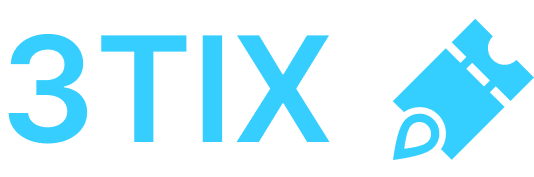

Application URL: https://hackfs2022.github.io/event-management/

HackFS 2022 showcase URL: https://ethglobal.com/showcase/3tix-r2ivv/

##### Table of Contents
- [Description](#description)
    * [How to use](#how-to-use)
- [Architecture and used dependencies](#architecture-and-used-dependencies)
    * [Current state](#current-state)
    * [Potential further improvements](#potential-further-improvements)

## Description
Create, sell, buy tickets on-chain.

Whether in the Metaverse or on planet earth, 3TIX makes it easy to manage tickets for any event.

### How to use
* Go to the app https://hackfs2022.github.io/event-management/
* Use any of the features:
  * Create event
  * Buy ticket
  * Claim QR code

## Architecture and used dependencies
### Current state
* User can connect the wallet via [Metamask](https://metamask.io)
* Frontend application deployed to [IPFS](https://ipfs.io/) via [Spheron](https://aqua.spheron.network/) or [alternative IPFS link](https://bafybeibh2k4ehwoomaiomqbmrvybaedy2xpvp6mpahg5jz3o6rbjtt6dxi.ipfs.infura-ipfs.io/) 
* Smart contract deployed and tested on [Polygon](https://polygon.technology/) [Mumbai](https://mumbai.polygonscan.com/address/0x16a51748274cd17fe9de674e44654ff68efd3936)
* On chain data for NFTs gathered via [Covalent](https://www.covalenthq.com/) and for events via [The Graph](https://thegraph.com/en/)
* Event and NFT details are published to [IPFS](https://ipfs.io/). [Example](https://bafkreihtgcppnqygiwxkny44kfp4raiz7o6dvmrkzzx4kgc5kksnytpgsy.ipfs.nftstorage.link)
* [POAP](https://poap.xyz/) to be distributed after the event

### Potential further improvements
* Enhance UI/UX: edit events, better ticket and event management features
* Make a mobile app to manage your tickets
* Make a mobile app for event orginisers (manage event and validate tickets for on-site event for example)